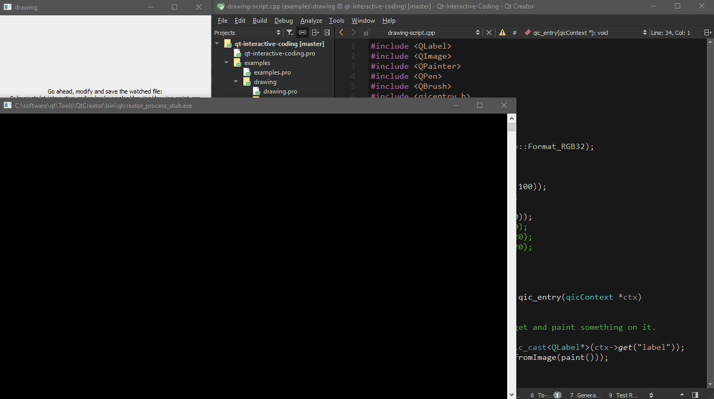

# Qt Interactive Coding

Author: [Martin Kutny](https://kutny.net/) \
License: MIT

## Summary

Simple, cross-platform library to automate the process of compilation and
execution of C++ code from within an application during runtime. Allows to
use C++ as a scripting language. This library is implemented using Qt and
therefore is suitable for integrating with Qt projects.

Possible uses:

- interactive / creative / live coding
- application scripting
- hot reloading

**Requirements:** Qt 5, native compiler toolchain \
**Platforms:** Windows, Linux, possibly other platforms supported by Qt

## Demo



## Integration

You can either build and link the `qicruntime.pro` as a shared or static
library, or add it directly into your Qt project by including `qicruntime.pri`.

## Usage

Basic example: Compiling and running C++ code at runtime.

``` c++
#include <qicruntime.h>

int main()
{
    qicRuntime rt;
    // configure your runtime build environment
    rt.setIncludePath({ "/path/to/src/qicruntime" });
    rt.setQmake("/path/to/qt/version/platform/bin/qmake");

    const char src[] = "#include <qicentry.h>\n"
                       "#include <stdio.h>\n"
                       "extern \"C\" QIC_DLL_EXPORT void qic_entry(qicContext *ctx) {\n"
                       "    printf("hello runtime!");\n"
                       "}\n";

    rt.exec(src);

    return 0;
}
```

## Interop

To interact and exchange data with the runtime-compiled code, use *context
variables*. An entire, complex application model can be shared with the runtime
code this way.

``` c++
class AppModel {
    // actually defined somewhere in a common header or shared library for both
    // the host program and the runtime-compiled code
};

int main()
{
    AppModel model;

    qicRuntime rt;
    rt.ctx()->set(&model, "model");

    rt.exec(...);
}
```

In the runtime code, access the *context variable* via the `qicContext`.

``` c++
#include <AppModel.h> // possibly also link AppModel.lib/.dll

extern "C" void qic_entry(qicContext *ctx)
{
    AppModel *const model = static_cast<AppModel*>(ctx->get("model"));
    model->... // access or modify data, call methods
}
```

For more examples, see the code in the [examples](src/examples/) directory.

## Design

The principle behind this library is very simple, no magic, no special tricks.
Conceptually, the process is similar to how plugin systems work and boils down
to 4 simple steps.

1. compile user code into a shared object (.dll)
2. dlopen()
3. entry_point = dlsym()
4. call entry_point(app_context)

The purpose of this library is to automate this process in a simple and
portable manner so that from the user's perspective this is a simple one-liner:

``` c++
//qicRuntime rt;
rt.exec(source_code);
```

To compile the runtime code, we make use of Qt's own build system `qmake`
and leverage its natural cross-platform capability.

There are no restrictions on what can or cannot go into the runtime-compiled
source code. The only requirement is that the user code exports one C-style
function that serves as the main entry point:

``` c++
extern "C" void qic_entry(qicContext *ctx);
```

The `qicContext` is a simple interface for exchange of `void*` pointers to
arbitrary data between the host program and the runtime code. This is most
flexible, as the user is free to use any techique for data exchange and
interaction:

- pointers to POD structures,
- C function pointers, callbacks,
- virtual base interfaces,
- full C++ classes in common shared libraries,
- or even build a complex data persistence mechanism on top of this.

## Gotchas and Limitations

1. Using this approach, you can run arbitrary code and freely manipulate the
   host program runtime data. However, you cannot change the structure of the
   running program. In other words, the binary code of the host program is
   never altered.

2. Make sure that both the host program and the runtime code are compiled in
   a binary compatible manner: using the same toolchain, same build options,
   and if they share any libraries, be sure that both link the same version
   of those libraries. Failing to do so is an invitation to undefined behavior
   and crashes.

3. You need to be aware of object lifetime and ownership when sharing data
   between the runtime code and the host program. At some point, the libraries
   that contain the runtime code will be unloaded - their code and data
   unmapped from the host process address space. If the host program accesses
   this data or code after it has been unloaded, it will result in a segfault.
   Typically, a strange crash just before the program exits, is indicative of
   an object lifetime/ownership issue.
